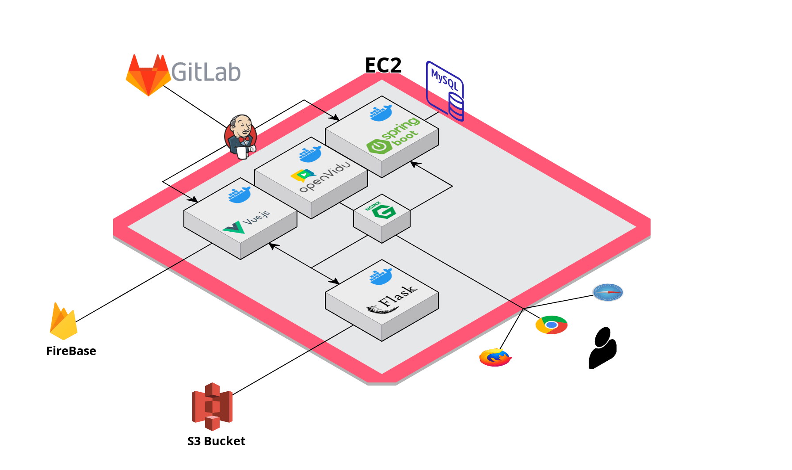
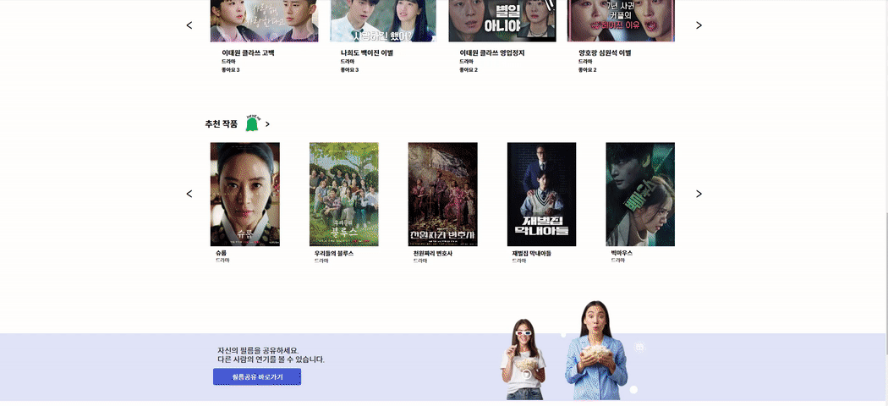

# 🎞Etjude - 우리 모두의 연기 연습 커뮤니티


### 프로젝트 진행 기간

2023.01.09(월) ~ 2023.02.17(금)


## Team Members

<div align="left">
  <table>
    <tr>
        <td align="center">
        <a href="">
          
        </a>
      </td>
      <td align="center">
        <a href="">
          
        </a>
      </td>
      <td align="center">
        <a href="">
          
        </a>
      </td>
      <td align="center">
        <a href="">
          
        </a>
      </td>
      <td align="center">
        <a href="">
          
        </a>
      </td>
      <td align="center">
        <a href="">
          
        </a>
      </td>
    </tr>
    <tr>
      <td align="center">
        <a href="">
          임두현
        </a>
      </td>
      <td align="center">
        <a href="">
          김지영
        </a>
      </td>
      <td align="center">
        <a href="https://github.com/variety82/">
          김창현
        </a>
      </td>
      <td align="center">
        <a href="https://github.com/TannyKim">
          김태균
        </a>
      </td>
      <td align="center">
        <a href="">
          박병우
        </a>
      </td>
        <td align="center">
        <a href="https://github.com/sujunghwang">
          황수정
        </a>
      </td>
    </tr>
  </table>
</div>


## 👓등장 배경

나도 모르게 드라마나 영화의 명장면을 따라해 보신적 있으신가요?

동아리, 동호회 등의 커뮤니티에 가입해 활동하기는 진입장벽이 너무 높다고 생각하시나요?

예술성을 키우고 나만의 작품을 만들어 보고 싶다고 생각하신 적이 있으신가요?

#### "당신이 만들, 당신이 만든, 당신의 작품 Etjude입니다"


## 개요

에쮸드(Etude)란 `연습교본` 이라는 뜻으로 그 자체로 하나의 작품을 뜻합니다.

연기연습을 해보고 싶은 일반인, 배우를 지망하는 배우지망생 모두에게

언제 어디에서나 인터넷만 있다면 쉽고 편리하게 연기연습을 도와줄 수 있는 서비스입니다.

궁극적으로 나의 생각과 감정을 표현하며 창조적 사고와 상상력을 키우며 새로운 가치를 창조해낼 수 있게 도와드립니다.


## Usage

````
git clone https://lab.ssafy.com/s08-webmobile1-sub2/S08P12A605.git

이후 exec폴더의 포팅메뉴얼을 따라 진행
````


### 개발환경


## Service Architecture




### 📂디렉토리 구조

<details>
  <summary>
  백엔드 디렉토리 구조
  </summary>
  ```
  
      unnamed
      ┣ api
      ┃ ┣ controller
      ┃ ┣ dto
      ┃ ┣ request
      ┃ ┣ response
      ┃ ┣ service
      ┣ common
      ┃ ┗ Scheduler
      ┣ config
      ┣ db
      ┃ ┣ entity
      ┃ ┗ repository
      ┗ UnnamedApplication.java
 </details>


<details>
  <summary>
  프론트엔드 디렉토리 구조
  </summary>
    ```


    FE
    ┣ public
    ┃ ┗ index.html
    ┣ src
    ┃ ┣ api
    ┃ ┣ assets
    ┃ ┃ ┣ scss
    ┃ ┃ ┣ video
    ┃ ┃ ┗ logo.png
    ┃ ┣ components
    ┃ ┃ ┣ common
    ┃ ┃ ┣ film
    ┃ ┃ ┣ main
    ┃ ┃ ┣ search
    ┃ ┃ ┣ share
    ┃ ┃ ┣ shareupload
    ┃ ┃ ┣ story
    ┃ ┃ ┣ studio
    ┃ ┣ dummy
    ┃ ┣ fonts
    ┃ ┣ mixins
    ┃ ┣ plugins
    ┃ ┣ router
    ┃ ┣ store
    ┃ ┣ translations
    ┃ ┣ utils
    ┃ ┣ views
    ┃ ┣ App.vue
    ┃ ┗ main.js

</details>


## 주요기능 및 화면

#### 로그인 & 로그아웃(구글OAuth)

- 우측 상단에 로그인 버튼을 누른 후 소셜 로그인을 진행할 수 있습니다
- 로그인을 한 사용자만 서비스를 이용하기 위한 스튜디오를 생성할 수 있습니다.


#### 추천작품

- 메인페이지의 가장하단에 좋아요 순으로 추천작품을 표시합니다.
- 특정 작품을 누르면 해당 작품의 스토리들이 표시됩니다.
- 스토리에는 스토리 설명, 배역설명, 스크립트를 볼 수 있습니다.


#### 추천스토리

- 작품탭에 들어갈 시 스튜디오를 생성할 수 있습니다.
- 팀이름, 팀원 추가여부를 선택하고 스튜디오를 생성할 수 있습니다.


#### 스튜디오

- 팀 이름과 같이 참여할 팀원을 선택하면 스튜디오가 생성됩니다.

  

- 화면 좌측 상단에서 생성한 스튜디오에 대한 정보를 표시합니다. (스튜디오는 7일간 생성되며 7일 후 자동 종료됩니다.)

- 화면 우측 상단에 팀으로 참여하는 멤버가 표시됩니다.


#### 스크립트

- 화면 우측에 첫 번째 탭을 클릭시 전체스크립트를 표시해 해당 스토리의 모든 대사를 볼 수 있고 영상시간에 맞는 대사가 화면 하단에 표시됩니다.
- 타임스탬프를 클릭 할 시 해당 장면으로 영상이 넘어갑니다. 화면 하단의 대사 또한 해당 시간에 맞는 대사로 넘어갑니다.
- 화면 하단의 스크립트를 넘길 시 영상도 그에 맞게 이동 됩니다.


#### 영상보기

- 해당 스토리의 영상을 볼 수 있습니다.
- 화면 전환 버튼을 누를 시 (배우의 영상, 배우와 나의 화면, 나의 화면) 세 종류의 화면전환이 가능합니다.
- 카메라/마이크의 on/off를 선택할 수 있습니다.


#### 녹화

- 전체스크립트 탭 또는 씬 녹화 탭에서 녹화를 누를 시 나의 화면이 녹화되고 녹화가 종료되면 녹화된 영상을 확인할 수 있습니다.(녹화를 한적이 없다면 해당 스토리의 원본 영상이 표시됩니다.)
- 녹화한 영상을 다운로드할 수 있습니다.


#### 필름제작

- 우측 세번째 탭에서 내가 녹화한 영상을 토대로 원본영상과의 교차편집 또는 나만의 연기영상을 만들 수 있습니다.
- (스튜디오를 생성한 팀장만 생성이 가능하며스튜디오 당 총 3번의 필름제작이 가능합니다)
- 녹화하지 않은 씬이 있을 경우 해당 씬은 원본스토리의 영상과 교차편집되어 제공합니다.


#### 채팅

- 스튜디오에 참여중인 팀원과 실시간 채팅을 할 수 있습니다.


#### 화상회의

- 화상회의 참여하기/떠나기를 선택할 하여 스튜디오에 참여중인 팀원과 실시간 화상회의를 할 수 있습니다.


#### 검색(전체, 카테고리별)

- 메인페이지 상단(또는 가운데)의 검색 또는 카테고리를 클릭시 원하는 작품을 조회/검색할 수 있습니다


#### 필름공유

- 필름 공유 글 업로드



- 필름 공유글 조회


