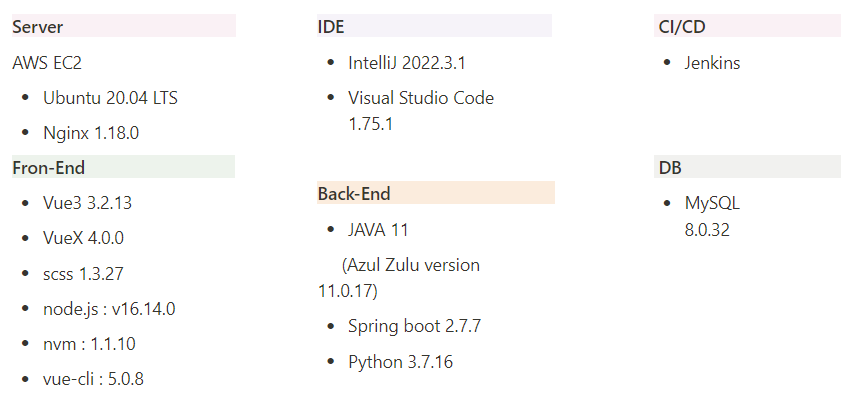
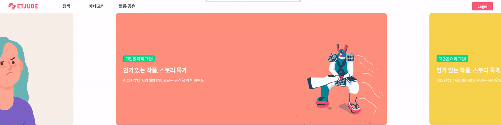
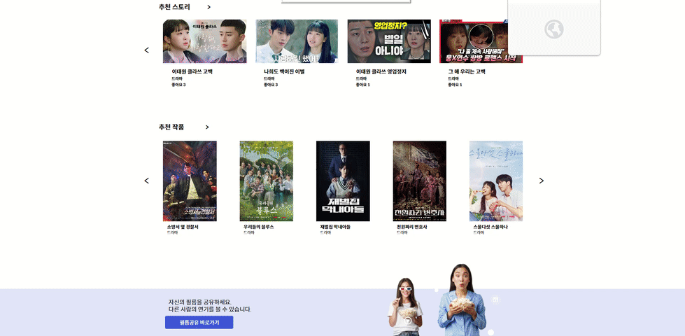
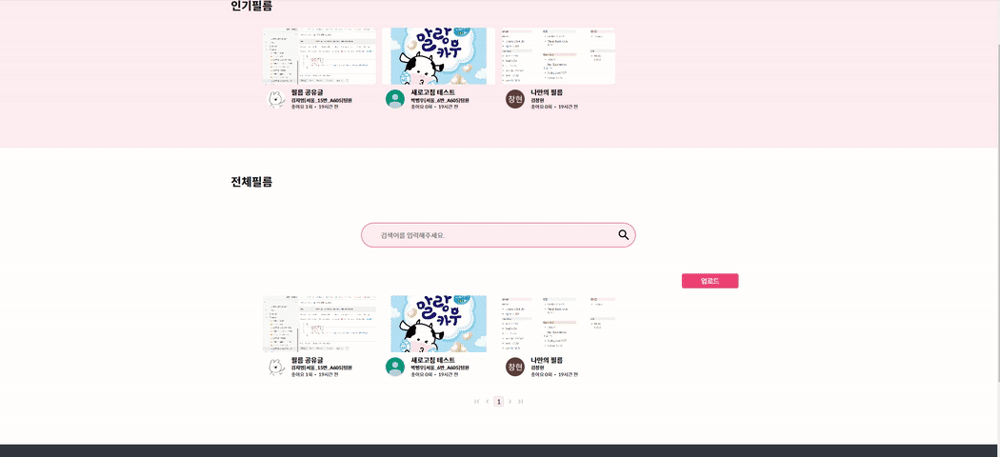

# 포팅 메뉴얼


## 목차

1. 환경설정 및 빌드 & 배포
2. 외부 서비스 문서
3. 시연시나리오


## 1. 환경설정 및 빌드&배포


### 개발환경




### Docker 설치

### Set up the repository

1. Update the `apt` package index and install packages to allow `apt` to use a repository over HTTPS:

```
$ sudo apt-get update
$ sudo apt-get install \\
    ca-certificates \\
    curl \\
    gnupg \\
    lsb-release
```

1. Add Docker's official GPG key

```
$ sudo mkdir -m 0755 -p /etc/apt/keyrings
$ curl -fsSL <https://download.docker.com/linux/ubuntu/gpg> | sudo gpg --dearmor -o /etc/apt/keyrings/docker.gpg
```

1. Use the following command to set up the repository

```
$ echo \\
  "deb [arch=$(dpkg --print-architecture) signed-by=/etc/apt/keyrings/docker.gpg] <https://download.docker.com/linux/ubuntu> \\
$(lsb_release -cs) stable" | sudo tee /etc/apt/sources.list.d/docker.list > /dev/null
```

### Install Docker Engine

1. Update the apt package index

```
$ sudo apt-get update
```

1. Install Docker Engine, containerd, and Docker Compose

```
$ sudo apt-get install docker-ce docker-ce-cli containerd.io docker-buildx-plugin docker-compose-plugin
```


### MySQL 설치

### Install MySQL

```
$ sudo apt install mysql-server
$ sudo mysql -u root -p
$ CREATE USER '아이디'@‘%' identified with mysql_native_password by '비밀번호';
$ FLUSH PRIVILEGES;
$ create database etjude;
$ use etjude;
GRANT ALL PRIVILEGES ON etjude.* to ‘아이디'@‘%';
```


### 외부 접속 허용

```
$ sudo vi /etc/mysql/mysql.conf.d/mysqld.cnf
bind-address값을 0.0.0.0 으로 수정
$ sudo servie mysql restart
```


### Nginx 설치

```jsx
$ sudo apt-get install nginx
```


### **Encrypt(SSL 발급)**

```jsx
$ sudo apt-get install letsencrypt
$ sudo letsencrypt certonly --standalone -d [도메인]
```


### OPEN VIDU 설정

```jsx
$ cd /opt
$ curl <https://s3-eu-west-1.amazonaws.com/aws.openvidu.io/install_openvidu_latest.sh> | bash
$ cd openvidu
$ nano .env

아래 내용으로 변경

1. DOMAIN_OR_PUBLIC_IP=도메인
2. OPENVIDU_SECRET=패스워드
3. CERTIFICATE_TYPE=letsencrypt
4. LETSENCRYPT_EMAIL=이메일

설정 완료 후
./openvidu start
```


### Nginx 설정

```jsx
$ cd /etc/nginx/sites-enabled
내부의 default 설정

server{
   location / {
            proxy_pass <http://localhost:3000/>;
            proxy_hide_header Access-Control-Allow-Origin;
            add_header 'Access-Control-Allow-Origin' '*';
            add_header 'Access-Control-Allow-Methods' 'GET, POST, DELETE, PUT, PATCH, OPTIONS';
            add_header 'Access-Control-Allow-Headers' 'Content-Type, Authorization';

    }
    location /api {
            proxy_pass <http://localhost:8080/api>;
    }
    location /api/v2{
            proxy_pass <http://localhost:5000/api/v2>;
    }
    location /openvidu{
            proxy_pass <http://localhost:5443>;
            proxy_set_header X-Real-IP $remote_addr;
            proxy_set_header X-Forwarded-For $proxy_add_x_forwarded_for;
            proxy_set_header X-Forwarded-Proto $scheme;
            proxy_set_header Host $host;
            proxy_http_version 1.1;
            proxy_set_header Upgrade $http_upgrade;
            proxy_set_header Connection "Upgrade";
    }

    listen 443 ssl;
    ssl_certificate /etc/letsencrypt/live/도메인/fullchain.pem;
    ssl_certificate_key /etc/letsencrypt/live/도메인/privkey.pem;
    ssl_protocols TLSv1 TLSv1.1 TLSv1.2 TLSv1.3;
    }
server {

    if ($host = 도메인) {
        return 301 https://$host$request_uri;
    }
        listen 80;
        server_name 도메인;
    return 404;
}
```

### 환경변수 형태

```jsx
---------Spring------------
application.yml 내 환경변수 설정

# MySQL
spring:
  datasource:
    url: jdbc:mysql://도메인:3306/데이터베이스이름?useUnicode=true&serverTimezone=Asia/Seoul
    username: username
    password: password
    driver-class-name: com.mysql.cj.jdbc.Driver
# S3
cloud:
	aws:
		credentials:
				accessKey: 엑세스 키 ID
				secretKey: 비밀 엑세스 키
		s3:
			bucket:버킷이름
		region:
			static: 설정한 지역명

----------Python-------------
.env 내 환경변수 설정
region_name=설정한 지역명,
aws_access_key_id = 엑세스 키 ID,
aws_secret_access_key = 비밀 엑세스 키

-------Front-End------------
# FireBase
VUE_APP_apiKey=
VUE_APP_authDomain=
VUE_APP_projectId=
VUE_APP_storageBucket=
VUE_APP_messagingSenderId=
VUE_APP_appId=
VUE_APP_measurementId=

# S3
VUE_APP_ACCESS_KEY= 
VUE_APP_SECRET_ACCESS_KEY= 
VUE_APP_AWS_REGION= 
VUE_APP_BUCKET_NAME= 
```


### Ignore 파일 및 생성파일 위치

- Spring : applicaion.yml (main/resources/applicaion.yml)
- Flask : .env (최상단 디렉토리)
- Vue : .env (최상단 디렉토리)


## 빌드 및 배포


### 프론트엔드 빌드

```jsx
build -t DockerHubID/DockerHubRepo:fe-latest .
```

### 백엔드 빌드

```jsx
# 스프링 빌드
Mac => ./gradlew clean build 후 ./gradlew build 진행
Windows => ./gradlew.bat clean build 후 ./gradlew.bat build 진행

build -t DockerHubID/DockerHubRepo:be-latest .

# 파이썬 빌드
build -t DockerHubID/DockerHubRepo:flask-latest .
```

### 배포

```jsx
프론트엔드, 백엔드의 이미지를 풀 받은 후 컨테이너 실행
docker pull DockerHubID/DockerHubRepo:해당tag

# 백엔드(스프링)
docekr run --rm -d -p 8080:8080 --name be-latest 이미지ID
# 백엔드(파이썬)
docekr run --rm -d -p 5000:8080 --name flask-latest 이미지ID
# 프론트엔드
docekr run --rm -d -p 3000:80 --name fe-latest 이미지ID

컨테이너 확인 : docker ps
```


## 2. 외부 서비스 문서

### FireBase

1. FireBase 프로젝트 생성

   - firebase 로그인 후 Firebase 콘솔에서 “프로젝트 추가” 버튼 클릭
   - 프로젝트 이름 입력 → 계속 → (애널리틱스 화면) 계속 → 계정 선택 후 프로젝트 만들기

2. SDK 설정

   - 해당 프로젝트 콘솔로 접속
   - 웹 아이콘 (</>) 클릭
     - 앱 닉네임 등록, firebase sdk 추가 (npm 사용 체크)
     - 콘솔로 이동

3. Authentication 설정

   - 콘솔에서 Authentication 클릭 → 로그인 방법 설정 클릭
   - 추가 제공업체 클릭 (구글)
   - 사용설정 토글 on
   - 프로젝트의 공개용 이름 설정(default 사용), 이메일 입력 ⇒ 저장

4. 도메인 연결

   - Authentication 탭이동
   - 승인된 도메인 탭 클릭
   - 도메인 추가 ⇒ [etjude.r-e.kr](http://etjude.r-e.kr)

5. Firebase package 설치

   ```jsx
   npm install firebase
   ```

### S3

1. https://www.aws.amazon.com/ 에 가입 후 S3로 이동
2. 프로젝트에 사용할 버킷을 생성
3. 버킷 이름, 리전, 퍼블릭 액세스 설정
4. IAM 에서 사용자 생성 후 AmazonS3FullAccess 권한 부여
5. 생성한 사용자의 AccessKey와 SecretKey를 발급 받고 프로젝트에 적용

### AWS S3 Bucket 설정

1. 버킷 정책

   ```json
   {
       "Version": "2012-10-17",
       "Statement": [
           {
               "Sid": "PublicReadGetObject",
               "Effect": "Allow",
               "Principal": "*",
               "Action": "s3:GetObject",
               "Resource": "arn:aws:s3:::s3ffmpegtest/*"
           }
       ]
   }
   ```

2. ACL

   - 버킷 소유자
     - 객체 : 나열, 쓰기, 읽기
     - 버킷 ACL : 읽기, 쓰기
   - 버킷 소유자
     - 객체 : 읽기
     - 버킷 ACL : 읽기

3. CORS

   ```json
   [
       {
           "AllowedHeaders": [
               "*"
           ],
           "AllowedMethods": [
               "HEAD",
               "GET",
               "PUT",
               "POST",
               "DELETE"
           ],
           "AllowedOrigins": [
               "*"
           ],
           "ExposeHeaders": [
               "ETag",
               "x-amz-meta-custom-header"
           ]
       }
   ]
   ```

   

   ## 3. 시연 시나리오

   

   #### 로그인 & 로그아웃(구글OAuth)

   - 우측 상단에 로그인 버튼을 누른 후 소셜 로그인을 진행할 수 있습니다
   - 로그인을 한 사용자만 서비스를 이용하기 위한 스튜디오를 생성할 수 있습니다.

   

   

   #### 추천작품

   - 메인페이지의 가장하단에 좋아요 순으로 추천작품을 표시합니다.
   - 특정 작품을 누르면 해당 작품의 스토리들이 표시됩니다.
   - 스토리에는 스토리 설명, 배역설명, 스크립트를 볼 수 있습니다.

   

   

   #### 추천스토리

   - 작품탭에 들어갈 시 스튜디오를 생성할 수 있습니다.
   - 팀이름, 팀원 추가여부를 선택하고 스튜디오를 생성할 수 있습니다.

   

   #### 스튜디오

   - 팀 이름과 같이 참여할 팀원을 선택하면 스튜디오가 생성됩니다.

     

   - 화면 좌측 상단에서 생성한 스튜디오에 대한 정보를 표시합니다. (스튜디오는 7일간 생성되며 7일 후 자동 종료됩니다.)

   - 화면 우측 상단에 팀으로 참여하는 멤버가 표시됩니다.

   

   

   #### 스크립트

   - 화면 우측에 첫 번째 탭을 클릭시 전체스크립트를 표시해 해당 스토리의 모든 대사를 볼 수 있고 영상시간에 맞는 대사가 화면 하단에 표시됩니다.
   - 타임스탬프를 클릭 할 시 해당 장면으로 영상이 넘어갑니다. 화면 하단의 대사 또한 해당 시간에 맞는 대사로 넘어갑니다.
   - 화면 하단의 스크립트를 넘길 시 영상도 그에 맞게 이동 됩니다.

   

   

   #### 영상보기

   - 해당 스토리의 영상을 볼 수 있습니다.
   - 화면 전환 버튼을 누를 시 (배우의 영상, 배우와 나의 화면, 나의 화면) 세 종류의 화면전환이 가능합니다.
   - 카메라/마이크의 on/off를 선택할 수 있습니다.

   

   

   #### 녹화

   - 전체스크립트 탭 또는 씬 녹화 탭에서 녹화를 누를 시 나의 화면이 녹화되고 녹화가 종료되면 녹화된 영상을 확인할 수 있습니다.(녹화를 한적이 없다면 해당 스토리의 원본 영상이 표시됩니다.)
   - 녹화한 영상을 다운로드할 수 있습니다.

   

   

   #### 필름제작

   - 우측 세번째 탭에서 내가 녹화한 영상을 토대로 원본영상과의 교차편집 또는 나만의 연기영상을 만들 수 있습니다.
   - (스튜디오를 생성한 팀장만 생성이 가능하며스튜디오 당 총 3번의 필름제작이 가능합니다)
   - 녹화하지 않은 씬이 있을 경우 해당 씬은 원본스토리의 영상과 교차편집되어 제공합니다.

   

   

   #### 채팅

   - 스튜디오에 참여중인 팀원과 실시간 채팅을 할 수 있습니다.

   

   

   #### 화상회의

   - 화상회의 참여하기/떠나기를 선택할 하여 스튜디오에 참여중인 팀원과 실시간 화상회의를 할 수 있습니다.

   

   

   #### 검색(전체, 카테고리별)

   - 메인페이지 상단(또는 가운데)의 검색 또는 카테고리를 클릭시 원하는 작품을 조회/검색할 수 있습니다

   

   

   #### 필름공유

   - 필름 공유 글 업로드
   
   
   
   - 필름 공유글 조회
   
   
